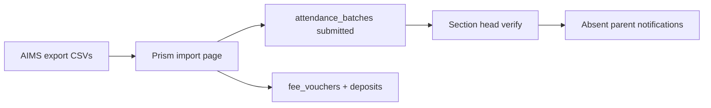

# AIMS → Prism CSV Sync

Extend AIMS with CSV exports for daily attendance, monthly fee vouchers, and fee deposits; add a Prism import page that loads those CSVs into attendance batches (submitted → section-head verify → parent alerts) and into an extended fee schema.

## Defaults

- **Scope:** both sides — extend AIMS export UI/API **and** add Prism import.
- **Fees:** extend Prism fee storage for month, amounts, paid/unpaid, and deposits (existing `fee_vouchers` file-link model is too thin for AIMS data).
- **Student match:** Prism `admission_no` ↔ AIMS `student_uid` (fallback: `student_cnic` ↔ Prism `cnic`).
- **Status map:** AIMS `1/2` → `present`, `3` → `absent`, `4` → `leave`.
- **Attendance lifecycle:** imported batches land as **`submitted`** (not draft/verified) so section heads still approve via existing Pending approval → verify → absent-parent notifications.

---

## Implementation todos

1. **Modify** AIMS `exportDailyAttendanceFromAims` (union archive tiers; keep CSV contract)
2. **Add** AIMS fee-voucher + fee-deposit export methods on the same controller + SAP page sections/routes
3. Extend Prism `fee_vouchers` + add `fee_deposits` migration/models for AIMS fields
4. Prism `AimsImportController` + CSV service: attendance (submitted batches), vouchers, deposits
5. Prism `AimsImportView` + route/nav + `import_aims_data` permission
6. Wire `/fees` to show imported voucher month/amount/paid; reuse `voucher_available` notify on import

---

## Part 1 — AIMS export (modify existing + add missing)

Primary home: [`ImportExportController`](D:/laragon/www/aims/app/Http/Controllers/ImportExportController.php) + [`export_for_sap.blade.php`](D:/laragon/www/aims/resources/views/export_for_sap.blade.php) + routes in [`web.php`](D:/laragon/www/aims/routes/web.php) (`/export-for-sap`, `/export/*`).

Controller ends with: `// IMPORT DATA FUNCTIONS ARE IN EFSC-SAP` — imports stay in Prism; only exports change in AIMS.

### Existing export inventory

| Method / route | UI on SAP page | Action for Prism sync |
|----------------|----------------|------------------------|
| `exportStudents` → `/export/students` | Visible | Leave as-is (roster not in this sync) |
| `exportDailyAttendanceFromAims` → `/export/daily-attendance` | Visible (date range + optional student_id) | **Modify** (see 1a) |
| `exportMonthlyAttendanceFromAims` → `/export/monthly-attendance` | **Hidden** (`display:none`) | Leave alone — monthly *summaries* are not what Prism day-batches need |
| `exportStudentTestsFromAims` → `/export/student-tests` | Visible | Out of scope |
| `exportStudentExamsFromAims` → `/export/student-exams` | Visible | Out of scope |
| Fee vouchers / deposits | **None** | **Add** new methods + UI (see 1b–1d) |

Shared patterns to reuse when adding fee exports: GET form → query → `fputcsv` → `storage_path('app/exports/...')` → `download(...)->deleteFileAfterSend(true)`.

### 1a. Modify `exportDailyAttendanceFromAims`

**Keep** request params (`start_date`, `end_date`, `student_id`) and CSV header:

`student_uid, student_r_uid, student_cnic, student_id, attendance_date, attendance_status, status`

**Change query** so a date range is complete for Prism:

- Today: only `daily_attendances` joined to current `academic_sessions.iscurrent = 1` — older days rolled into `monthly_attendances` / `attendance_archives` are missing.
- Target: union (or three queries merged) of `daily_attendances` + `monthly_attendances` + `attendance_archives`, same selected columns + student join; apply the same date/student filters; de-dupe on `(student_id, attendance_date)` if a row can appear in more than one tier.
- Keep existing 1–4 status normalization logic.
- Optional: require `start_date`/`end_date` when exporting large windows to avoid huge files (UI already has the fields).

Do **not** repurpose `exportMonthlyAttendanceFromAims` for Prism — it aggregates counts by month, which cannot rebuild per-day `attendance_batches`.

### 1b. Add `exportFeeVouchers` (new method, same controller)

- Mirror deposit-list mental model: required **voucher month** (`m-Y` or `YYYY-MM`), optional class filter (reuse `$academicClasses` already passed to the page).
- Source: `student_fee_vouchers` (`status != 0`) filtered by `voucher_month`, join `students`, sum dues/payments from `student_fee_accounts` (`fee_type` 0 / 1).
- CSV columns:

`student_uid, student_r_uid, student_cnic, student_id, voucher, voucher_type, voucher_no, voucher_month, due_date, voucher_status, total_due, total_paid`

- Route: `GET /export/fee-vouchers` → `export.fee-vouchers`.

### 1c. Add `exportFeeDeposits` (new method, same controller)

- Required **deposit month**; filter `student_fee_accounts` where `fee_type = 1` and `fee_date` in that month; join voucher + student (same join style as `AccountController::depositlist`).
- CSV columns:

`student_uid, student_r_uid, student_cnic, student_id, voucher, amount, fee_date, voucher_month, voucher_status`

- Route: `GET /export/fee-deposits` → `export.fee-deposits`.

### 1d. Modify `export_for_sap.blade.php` + routes

- Add two `export-section` blocks (same markup style as Daily Attendance): month input + submit.
- Register the two GET routes next to the existing `/export/daily-attendance` lines.
- Leave Students / Tests / Exams / hidden Monthly Attendance sections unchanged.

---

## Part 2 — Prism import (`D:\laragon\www\prism`)

### 2a. Web import page

- New view e.g. [`web/src/views/admin/AimsImportView.vue`](../web/src/views/admin/AimsImportView.vue) — layout similar to AIMS export page: three upload cards (daily attendance, fee vouchers, fee deposits).
- Route e.g. `/admin/aims-import` (or `/import`), nav for roles with new permission `import_aims_data` (seed for `computer_operator`, `accountant`, `admin`, SA/DV).
- Show import summary: created / updated / skipped / unmatched student UIDs.

### 2b. API

- Controller e.g. [`api/app/Http/Controllers/Api/Efsc/AimsImportController.php`](../api/app/Http/Controllers/Api/Efsc/AimsImportController.php)
- Routes under `/api/efsc/import/...`:
  - `POST attendance` (multipart CSV)
  - `POST fee-vouchers` (multipart CSV)
  - `POST fee-deposits` (multipart CSV)
- Service class e.g. `App\Services\Aims\AimsCsvImportService` for parse + upsert logic.

### 2c. Attendance import behavior

Reuse batch model in [`AttendanceController`](../api/app/Http/Controllers/Api/Efsc/AttendanceController.php):

1. Parse CSV; resolve each row to Prism `students` via `admission_no = student_uid` (then CNIC).
2. Skip / report unmatched rows; require student has `section_id`.
3. Group by `(section_id, attendance_date)`.
4. For each group:
   - If batch exists and status is `verified` (or `submitted` with conflict policy): **skip** and report.
   - Else create/replace records; set batch `status = submitted`, `submitted_by_user_id = importer`.
5. Do **not** call verify — section head uses existing Attendance → Pending approval → `POST .../verify`, which already fires `attendance.absent_parent_alert`.

Optional: allow import as `draft` via flag; default **submitted**.

### 2d. Fee schema extension + import

Migrate / extend beyond today’s thin [`FeeVoucher`](../api/app/Models/FeeVoucher.php):

**`fee_vouchers` add (or replace usage of file-only fields):**

- `external_voucher` (AIMS voucher int, unique with student)
- `voucher_month` (date, 1st of month)
- `due_date`
- `voucher_type`, `voucher_no`
- `total_due`, `total_paid`
- `payment_status` (`unpaid`|`paid`) mapped from AIMS voucher status 1/2
- Keep `title` (e.g. `Fee — Jul 2026`), `file_path` nullable, `submission_status` for parent proof flow if still needed

**New `fee_deposits`:**

- `fee_voucher_id` (nullable FK), `student_id`, `external_voucher`, `amount`, `fee_date`, `imported_at`

Import vouchers upsert by `(student_id, external_voucher)` or `(student_id, voucher_month)`.  
Import deposits create deposit rows and set voucher `payment_status=paid` / bump `total_paid` when voucher matches.

On new voucher import, reuse existing `fee.voucher_available` notification path from [`FeeVoucherController`](../api/app/Http/Controllers/Api/Efsc/FeeVoucherController.php) where appropriate (same approval pipeline as today).

Wire `/fees` away from Coming Soon to a minimal list that shows month, amounts, paid status (can enhance [`FeeView.vue`](../web/src/views/FeeView.vue) / parent fees later; import page is the primary staff entry for this phase).

---

## Part 3 — Permissions & docs

- Seed permission `import_aims_data` in roles seeder.
- Short note in [`ReadMe.md`](../ReadMe.md) or leave for later — only if you want docs updated.
- Update [`document.md`](../document.md) attendance/fees rows once shipped (optional follow-up).

---

## Out of scope

- Bidirectional sync / live API between AIMS and Prism
- Student roster import (AIMS already exports students; Prism enroll remains manual/admin)
- Changing verify/notification pipeline beyond using it as-is
- Mobile import UI

---

## Key files to touch

| Area | Files |
|------|--------|
| AIMS (modify) | `exportDailyAttendanceFromAims` in `ImportExportController.php`; `export_for_sap.blade.php`; `routes/web.php` |
| AIMS (add) | `exportFeeVouchers`, `exportFeeDeposits` on same controller + two SAP page sections |
| AIMS (leave) | Students, monthly attendance, tests, exams exports |
| Prism API | new `AimsImportController`, `AimsCsvImportService`, fee migrations/models, routes, permission seeder |
| Prism web | new `AimsImportView.vue`, router + nav, optionally `FeeView.vue` routing |
| Reuse | `AttendanceController::verify` + `NotificationDispatchService` unchanged |
